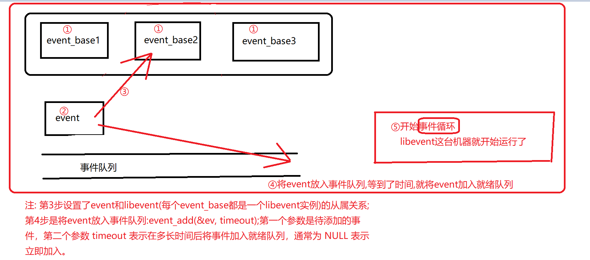

[TOC]


# libevent事件处理框架分析

libevent最大的特点:
封装了对以下三种事件的响应:IO事件,定时器事件,信号事件.
这里就只分析libevent这一点的,
在libevent中还包括一些其他的功能(如缓冲区),但是我这里就重点讲解这一部分了.

事件原型,简单看一看用于封装事件的结构体定义:
```cpp
struct event {
    TAILQ_ENTRY (event) ev_next;
    TAILQ_ENTRY (event) ev_active_next;
    TAILQ_ENTRY (event) ev_signal_next;
    unsigned int min_heap_idx;    /* for managing timeouts */

    struct event_base *ev_base;

    int ev_fd;
    short ev_events;
    short ev_ncalls;
    short *ev_pncalls;    /* Allows deletes in callback */

    struct timeval ev_timeout;

    int ev_pri;        /* smaller numbers are higher priority */
	
	//回调函数,也就是说:当所关注的事件发生时,所要触发的函数:
	//是注册到这个函数指针中的.
    void (*ev_callback)(int, short, void *arg);
    void *ev_arg;

    int ev_res;        /* result passed to event callback */
    int ev_flags;
};
```
- 1) IO事件:
再简单不过了,对select/epoll/poll等之类的调用进行封装即可,所提供的接口无非这几种:
```cpp
struct eventop {
    const char *name;
    void *(*init)(struct event_base *);
    int (*add)(void *, struct event *);
    int (*del)(void *, struct event *);
    int (*dispatch)(struct event_base *, void *, struct timeval *);
    void (*dealloc)(struct event_base *, void *);
    /* set if we need to reinitialize the event base */
    int need_reinit;
};
```
在我看过的很多开源服务器源码(如lighttpd)中都有类似的封装,不是什么新鲜的东西.

- 2)定时器事件:
libevent采用`堆数据结构`存放所要定时的事件的时间,
大家都知道`堆可以用来实现优先队列`,
在这里,所有的定时器就放在这样的一个数据结构中了.
- 3)信号事件:所有的信号都注册回调函数为evsignal_handler(在signal.c中),
这个函数的功能就是:
在某信号被触发的时候将该信号被触发的计数器加1,同时置一个标志位表示有信号被触发.

Now,把所有这些结合起来,看看libevent框架的主循环是如何工作的,用简单的伪码表示:

```c
主循环
      更新当前时间

      将`当前时间`与`存放时间`的`堆`中的时间依次进行比较,由于是采用`堆`实现的,这里查找相当的快,于是`所有可以被触发的定时器事件`都从堆中被取出,同时取下的事件被放到一个`活动事件`的队列中

      调用`封装IO操作的dispatch函数`,在其中也将`被触发的IO事件`加入到`那个存放活动事件的队列`中

      在dispatch的函数中,如果信号被触发的标志位被置位,说明有信号被触发,调用evsignal_process函数,这个函数的功能也是把所有被触发的事件放到活动事件的队列中

       好了,现在所有可以被触发的事件都在活动事件队列中了,依次遍历取出来调用它们注册的回调函数就成了.
```

上面就是libevent处理这三种事件的大体框架.

==说一说我认为这个框架存在的缺点:==
		==1) callback函数只能有一个,假设这样一个场景,
我需要对某个连接socket同时监控它的可读/可写/超时事件,
那么我需要针对同一个socket fd生成三个event对象.==

==2) 在主循环中,
每次都要去查询存放时间的堆看看有没有定时器事件可以被触发,
问题在于:
很多时候,一个主循环很快就到了下一次,而时间过去的并不多,
这次去检查时间是冗余的操作,
当然了,由于libevent的定时器是精确到毫秒级别的,
所以有这么做的必要,
但是在一个真正的服务器中,我怀疑有多少需要精确到微秒级别的事件,
所以呢,我觉得这个可以做一个改进,
每次更新时间之后跟上一次更新的时间做一个比较,
如果超过了一秒(或者把这个间隔改成可以由使用者配置的)再去检查堆上面的时间.==

<font color=orange>But,其实上面这两个都不是问题：</font>
1) ==所关心的不同事件类型可以在注册时指明，不必通过不同的event对象来设置==。如：
`event_set(&evfifo, socket, EV_READ | EV_WRITE, fifo_read, &evfifo);`
而当所关心的事件触发的时候，libevent在调用你的回调函数的时候会指明事件的类型—通过回调函数的第二个参数(是一个|值)。你只要在回调函数判断一下事件类型即可。
2) libevent不会做多余的检查。主循环的==timeout_next==会取出距离下一个超时时间有多久(最小堆的取最小值操作，是O(1)的复杂度)，而这个==timeout==最终会交给类似于==select/poll/epoll_wait==这样的系统调用，作为timeout。也就说，在这个timeout时间内，如果没有在select/epoll上注册的事件发生，libevent是阻塞了的。libevent的这种处理方式已经是惯例了的。你那种“改进”不精确，也不高效。

# libevent源码深度剖析一

### 1 前言

Libevent是一个轻量级的开源高性能网络库

Libevent是用c语言编写的

### 2 Libevent简介

Libevent 有几个显著的亮点：

- 事件驱动（event-driven），高性能;
- 轻量级，专注于网络，不如ACE那么臃肿庞大；
- 源代码相当精炼、易读；
- 跨平台，支持Windows、Linux、*BSD和Mac Os；
- 支持多种I/O多路复用技术， epoll、poll、dev/poll、select和kqueue等；
- 支持I/O，定时器和信号等事件；
- 注册事件优先级；

### 3 学习的好处

只对libevent本身的框架大概了解，那或许仅仅是一知半解，不深入代码分析，就难以了解其设计的精巧之处，也就难以为自己所用。

事实上Libevent本身就是一个典型的Reactor模型，理解Reactor模式是理解libevent的基石；因此下一节将介绍典型的事件驱动设计模式——Reactor模式。

# libevent源码深度剖析二

前面讲到，整个libevent本身就是一个Reactor，因此本节将专门对Reactor模式进行必要的介绍，并列出libevnet中的几个重要组件和Reactor的对应关系，在后面的章节中可能还会提到本节介绍的基本概念。

### 1 Reactor的事件处理机制

首先来回想一下普通函数调用的机制：

程序调用某函数——》函数执行——》程序等待——》函数将结果和控制权返回给程序 ——》 程序继续处理。

Reactor释义“反应堆”，是一种事件驱动机制。

和普通函数调用的不同之处在于：

==应用程序不是主动的调用某个API完成处理，==

==而是恰恰相反，Reactor “逆置” 了事件处理流程，应用程序需要提供相应的接口并注册到Reactor上，==

==如果相应的时间发生，Reactor将主动调用应用程序注册的接口，这些接口又称为“回调函数”。使用Libevent 也是 在Libevent框架中 注册相应的事件和回调函数；==

==当这些事件发生时，Libevent会调用这些回调函数处理相应的事件（I/O读写、定时和信号）。==
        

举个例子：你去应聘某xx公司，面试结束后。

- “普通函数调用机制”公司HR比较懒，不会记你的联系方式，那怎么办呢，你只能面试完后自己打电话去问结果；有没有被录取啊，还是被拒绝了；

- “Reactor机制”公司HR就记下了你的联系方式，结果出来后会主动打电话通知你：有没有被录取啊，还是被拒了；你不用自己打电话去问结果，事实上也不能，你没有HR的留联系方式。

上面这个例子非常的生动形象：说白了，普通函数调用机制需要你自己动手；而Reactor机制是全自动的。（所以说，Reactor非常的吊，这就是科技的力量，越来越多的东西都将变成全自动的，大大的节省了人力物力的浪费，正如华为余大嘴所说：遥遥领先！！！）

### 2 Reactor模式的优点

Reactor模式是编写高性能网络服务器的必备技术之一，它具有如下的优点：
    1）响应快，不必为单个同步时间所阻塞，虽然==Reactor本身依然是同步的；==
    2）编程相对简单，可以最大程度的避免复杂的多线程及同步问题，并且避免了==多线程/进程==的切换开销；
    3）可扩展性，可以方便的通过==增加Reactor实例个数==来充分利用CPU资源；
    4）可复用性，==reactor框架本身与具体事件处理逻辑无关==，具有很高的复用性；

### 3 Reactor模式框架

​    使用Reactor模型，必备的几个组件：==事件源、Reactor框架、多路复用机制和事件处理程序==，先来看看Reactor模型的整体框架，接下来再对每个组件做逐一说明。

1） ==事件源==

Linux上是文件描述符，Windows上就是Socket或者Handle了，这里统一称为“句柄集”；==程序在指定的句柄上注册关心的事件==，比如I/O事件。

也就是martin老师在奇牛学院学院教我们的fd事件句柄，一个fd代表了一个事件

2） ==event demultiplexer——事件多路分发机制==

由==操作系统提供的I/O多路复用机制==，比如==select，poll和epoll==。

程序首先将其关心的句柄（==事件源==）及其事件==注册到event demultiplexer上==；

当==有事件到达==时，event demultiplexer会发出==通知== ： “在==已经注册的句柄集==中，一个或多个句柄的事件已经就绪”；

程序收到通知后，就可以在==非阻塞的情况==下对事件进行处理了。

==对应到libevent中，依然是select、poll、epoll等==，但是libevent使用==结构体eventop==进行了封装，以统一的接口来支持这些I/O多路复用机制，达到了对外隐藏底层系统机制的目的。

3） Reactor——反应器

==Reactor，是事件管理的接口==，内部==使用event demultiplexer注册、注销事件==，并运行==事件循环==，当有事件进入“==就绪==”状态时，调用==注册事件==的==回调函数==处理事件。

对应到libevent中，就是==event_base结构体==。

一个典型的Reactor声明方式

```cpp
class Reactor  
{  
public:  
    int register_handler(Event_Handler *pHandler, int event);//注册，Event_Handler在（4）
    int remove_handler(Event_Handler *pHandler, int event);//移除
    void handle_events(timeval *ptv);//处理
};  
```

4） ==Event Handler==——事件处理程序

==事件处理程序==提供了一组接口，==每个接口对应了一种类型的事件==，供Reactor在相应的事件发生时调用，执行相应的事件处理。通常它会绑定一个有效的句柄。

==对应到libevent中，就是event结构体。==

下面是两种典型的==Event Handler==类声明方式，二者互有优缺点。

```cpp
class Event_Handler  
{  
public:  
   virtual void handle_read() = 0;  
   virtual void handle_write() = 0;  
   virtual void handle_timeout() = 0;  
   virtual void handle_close() = 0;  
   virtual HANDLE get_handle() = 0;  
   // ...  
};

class Event_Handler  
{  
public:  
    // events maybe read/write/timeout/close .etc  
    virtual void handle_events(int events) = 0;  
    virtual HANDLE get_handle() = 0;  
    // ...  
};  
```


# libevent源码深度剖析三

### 1 前言

学习源代码该从哪里入手？我觉得从程序的==基本使用场景==和==代码的整体处理流程==入手是个不错的方法，至少从个人的经验上讲，用此方法分析libevent是比较有效的。

### 2 基本应用场景

基本应用场景也是使用libevnet的基本流程，下面来考虑一个最简单的场景：

使用livevent设置定时器，应用程序只需要执行下面几个简单的步骤即可。

1）首先==初始化libevent库==，并保存返回的指针（**event_base**）
`struct event_base * base = event_init();`
实际上这一步相当于初始化一个Reactor实例；

==在初始化libevent后，就可以注册事件了。==

2）初始化事件event，设置==回调函数和关注的事件==（**event**）

`evtimer_set(&ev, timer_cb, NULL);`

事实上这==等价于==调用

`event_set(&ev, -1, 0, timer_cb, NULL);`//ev，fd，fd的类型（读or写or信号），回调函数，回调函数的参数

event_set的函数原型是：

```cpp
void event_set(struct event *ev, int fd, short event, void (*cb)(int, short, void *), void *arg)
```

- ev：执行要初始化的event对象；
- fd：该event绑定的“句柄”，对于信号事件，它就是关注的信号；
- event：在该fd上关注的事件类型，它可以是EV_READ, EV_WRITE, EV_SIGNAL；//读 写 信号
- cb：这是一个函数指针，当fd上的事件event发生时，调用该函数执行处理，
它有三个参数：==调用时由event_base负责传入，==
按顺序，实际上就是event_set时的fd, event和arg；//事件句柄、事件类型、额外参数
- arg：传递给cb函数指针的参数；
由于==定时事件不需要fd==，并且定时事件是根据添加时（event_add）的超时值设定的，
因此这里event也不需要设置。
这一步相当于==初始化一个event handler，在libevent中事件类型保存在event结构体中==。
注意：==libevent并不会管理event事件集合，这需要应用程序自行管理；==

(<font color=red> 1.`evtimer_set` 函数用于设置一个定时器事件（timer event），它会在指定的时间间隔后触发。参数 `&ev` 是指向 `struct event` 结构的指针，`timer_cb` 是定时器事件触发时要调用的回调函数，`NULL` 则是传递给回调函数的参数。</font>

<font color=red>2.`event_set` 函数用于设置一个通用的事件处理器，它可以处理读、写、或者信号等事件。参数中的 `-1` 表示该事件不与任何具体的文件描述符相关联，`0` 表示不限制事件类型，`timer_cb` 是事件触发时要调用的回调函数，`NULL` 则是传递给回调函数的参数。</font>

<font color=red>从你的描述中可以看出，这两个函数实际上只有在设置定时器事件才可以互相替代，因为`evtimer_set`专门处理的是定时器事件，定时器事件不需要提供文件描述符和事件类型，而如果你将event_set函数的文件描述符设置为 `-1`，事件类型设置为 `0`，这与 `evtimer_set` 一样了。</font>)

3）设置event从属的event_base（**设置event从属的event_base**）
`event_base_set(base, &ev);`//ev是event，base是event_base
这一步相当于指明`event要注册到哪个event_base实例上`；

4）是正式的添加事件的时候了（==准备开始战斗了，但是还没开始==，==第2步骤和第3步骤其实是设置事件，而这一步是将事件放入事件队列==）
`event_add(&ev, timeout);`
基本信息都已设置完成，只要简单的调用event_add()函数即可完成，其中timeout是定时值；
这一步相当于调用Reactor::register_handler()函数注册事件。

5）程序进入无限循环，等待就绪事件并执行事件处理（==战斗正式打响==）
`event_base_dispatch(base);`



### 3 实例代码

上面例子的程序代码如下所示

```cpp
struct event ev;  //事件
struct timeval tv;  
void time_cb(int fd, short event, void *argc)  
{  
    printf("timer wakeup/n");  
    event_add(&ev, &tv); // reschedule timer  
}  
int main()  
{  
    //1.搞一个libevent实例
    struct event_base *base = event_init();  
    
    //设置超时时间
    tv.tv_sec = 10; // 10s period  
    tv.tv_usec = 0;  
    
    //2.定时器事件
    evtimer_set(&ev, time_cb, NULL);//设置定时器事件，每十秒就输出一次timer wakeup哈哈哈
    
    //3.将ev 这个事件加入事件队列进行等待
    event_add(&ev, &tv); 
    
    //4.开启事件循环
    event_base_dispatch(base);  
}  
```

### 我从小到大都有个疑惑:上面的代码怎么没有为libevent挑选系统内核调用? 到底用的是select还是poll还是epoll?

答:如果你使用 `struct event_base *base = event_init();` 这样的代码初始化 Libevent，它会根据运行环境选择最佳的后端。具体来说，它会按照以下顺序尝试选择后端：

1. 首先会尝试使用 `epoll`，如果系统支持并且可用的话。
2. 如果不支持 `epoll`，它会尝试使用 `kqueue` （在 BSD 系统上）。
3. 如果也不支持 `kqueue`，它会尝试使用 `poll`。
4. 最后，如果以上都不支持，它会使用 `select`。

所以，Libevent 会尝试按照性能和可用性的顺序选择最佳的后端，从而在不同的系统上保证最佳的性能表现。

<font color=red>哦!原来是自动挑选!神奇!</font>

### 4 事件处理流程

当应用程序向libevent注册一个事件后，libevent内部是怎么样进行处理的呢？

1）首先==应用程序准备并初始化event==，设置好==事件类型==和==回调函数==；这对应于前面==第2和3步骤==；

2）==向libevent添加该事件event==。

- 对于定时事件，libevent使用一个小根堆管理，key为超时时间；

- 对于Signal和I/O事件，libevent将其放入到等待链表（wait list）中，这是一个双向链表结构；

3）程序==调用event_base_dispatch()系列函数进入无限循环，等待事件==，

以==select()函数==为例:

每次循环前libevent会检查定时事件的==最小超时时间tv==，根据tv设置select()的最大等待时间，以便于后面及时处理超时事件；

当select()返回后，首先检查超时事件，然后检查I/O事件；

Libevent将所有的就绪事件，放入到激活链表中；

然后对激活链表中的事件，调用事件的回调函数执行事件处理；

> 补充 : 
>
> 在 Libevent 中，最小超时时间（也称为最短等待时间）指的是距离现在最近的定时事件触发的时间间隔。这是由于 Libevent 维护了一个定时器堆（timer heap），它会根据所有已注册的定时事件计算出最短的时间间隔，以确保在下一个事件循环中及时地触发最近的定时事件。
>
> 最大等待时间则是指在调用 I/O 多路复用函数（如 `select`、`poll`、`epoll` 等）时，设置的最大等待时间。这个时间决定了在没有任何事件发生时，事件循环会阻塞多长时间。

### 5 小结

本节介绍了libevent的简单实用场景，并旋风般的介绍了libevent的事件处理流程，读者应该对libevent有了基本的印象，下面将会详细介绍libevent的事件管理框架（Reactor模式中的Reactor框架）做详细的介绍，在此之前会对源代码文件做简单的分类。

# libevent源码深度剖析四

### 1 前言

详细分析源代码之前，如果能对其代码文件的基本结构有个大概的认识和分类，对于代码的分析将是大有裨益的。本节内容不多，我想并不是说它不重要！

### 2 源代码组织结构

Libevent的源代码虽然==都在一层文件夹下面==，

但是其代码分类还是相当清晰的，

主要可分为==头文件==、==内部使用的头文件==、==辅助功能函数==、==日志==、==libevent框架==、==对系统I/O多路复用机制的封装==、==信号管理==、==定时事件管理==、==缓冲区管理==、==基本数据结构和基于libevent的两个实用库==等几个部分，有些部分可能就是一个源文件。
源代码中的test部分就不在我们关注的范畴了。
1）头文件
主要就是==event.h==：事件宏定义、接口函数声明，主要==结构体event==的声明；
2）内部头文件
==xxx-internal.h==：内部数据结构和函数，对外不可见，以达到信息隐藏的目的；
3）libevent框架
==event.c==：event整体框架的代码实现；
4）对系统I/O多路复用机制的封装
==epoll.c==：对epoll的封装；
==select.c==：对select的封装；
==devpoll.c==：对dev/poll的封装;
==kqueue.c==：对kqueue的封装；
5）定时事件管理
==min-heap.h==：其实就是一个以时间作为key的小根堆结构；
6）信号管理
==signal.c==：对信号事件的处理；
7）辅助功能函数
==evutil.h 和evutil.c==：一些辅助功能函数，包括创建socket pair和一些时间操作函数：加、减和比较等。
8）日志
==log.h和log.c==：log日志函数
9）缓冲区管理
==evbuffer.c和buffer.c==：libevent对缓冲区的封装；
10）基本数据结构
compat/sys下的两个源文件：==queue.h==是libevent基本数据结构的实现，包括==链表，双向链表，队列==等；==_libevent_time.h==：一些用于时间操作的结构体定义、函数和宏定义；
11）实用网络库
==http和evdns==：是基于libevent实现的==http服务器==和==异步dns查询库==；

### 3 小结

本节介绍了libevent的组织和分类，下面将会详细介绍libevent的核心部分event结构。

# libevent源码深度剖析五

对事件处理流程有了高层的认识后，本节将详细介绍libevent的核心结构event，以及libevent对event的管理。

### 1 libevent的核心-event

Libevent是基于事件驱动（event-driven）的，从名字也可以看到event是整个库的核心。event就是Reactor框架中的事件处理程序组件；它提供了函数接口，供Reactor在事件发生时调用，以执行相应的事件处理，通常它会绑定一个有效的句柄。
首先给出event结构体的声明，它位于event.h文件中：

```c
struct event {  
  TAILQ_ENTRY (event) ev_next;  
  TAILQ_ENTRY (event) ev_active_next;  
  TAILQ_ENTRY (event) ev_signal_next;  
  unsigned int min_heap_idx; /* for managing timeouts */  
  struct event_base *ev_base;  
  int ev_fd;  
  short ev_events;  
  short ev_ncalls;  
  short *ev_pncalls; /* Allows deletes in callback */  
  struct timeval ev_timeout;  
  int ev_pri;  /* smaller numbers are higher priority */  
  void (*ev_callback)(int, short, void *arg);  
  void *ev_arg;  
  int ev_res;  /* result passed to event callback */  
  int ev_flags;  
};  
```


下面简单解释一下结构体中各字段的含义。

1）ev_events：

event关注的事件类型，它可以是以下3种类型：

- I/O事件： EV_WRITE和EV_READ

- 定时事件：EV_TIMEOUT

- 信号：    EV_SIGNAL

- 辅助选项：EV_PERSIST，表明是一个永久事件

Libevent中的定义为：

```c
#define EV_TIMEOUT 0x01  
#define EV_READ  0x02  
#define EV_WRITE 0x04  
#define EV_SIGNAL 0x08 
#define EV_PERSIST 0x10 /* Persistant event */  
```

可以看出事件类型可以使用“|”运算符进行组合，需要说明的是，==信号和I/O事件不能同时设置==；

还可以看出libevent使用event结构体将这3种事件的处理统一起来；

2）ev_next，ev_active_next和ev_signal_next都是双向链表节点指针；它们是libevent对不同事件类型和在不同的时期，对事件的管理时使用到的字段。

libevent使用双向链表保存所有注册的I/O和Signal事件，ev_next就是该I/O事件在链表中的位置；称此链表为“已注册事件链表”；

同样ev_signal_next就是signal事件在signal事件链表中的位置；

ev_active_next：libevent将所有的激活事件放入到链表active list中，然后遍历active list执行调度，ev_active_next就指明了event在active list中的位置；

3）min_heap_idx和ev_timeout，如果是timeout事件，它们是event在小根堆中的索引和超时值，libevent使用小根堆来管理定时事件，这将在后面定时事件处理时专门讲解

4）ev_base该事件所属的反应堆实例，这是一个event_base结构体，下一节将会详细讲解；

5）ev_fd，对于I/O事件，是绑定的文件描述符；对于signal事件，是绑定的信号；

6）ev_callback，event的回调函数，被ev_base调用，执行事件处理程序，这是一个函数指针，原型为：

void (*ev_callback)(int fd, short events, void *arg)

其中参数fd对应于ev_fd；events对应于ev_events；arg对应于ev_arg；

7）ev_arg：void*，表明可以是任意类型的数据，在设置event时指定；

8）eb_flags：libevent用于标记event信息的字段，表明其当前的状态，可能的值有：

1. \#define EVLIST_TIMEOUT 0x01 // event在time堆中  
2. \#define EVLIST_INSERTED 0x02 // event在已注册事件链表中  
3. \#define EVLIST_SIGNAL 0x04 // 未见使用  
4. \#define EVLIST_ACTIVE 0x08 // event在激活链表中  
5. \#define EVLIST_INTERNAL 0x10 // 内部使用标记  
6. \#define EVLIST_INIT     0x80 // event已被初始化  

9）ev_ncalls：事件就绪执行时，调用ev_callback的次数，通常为1；

10）ev_pncalls：指针，通常指向ev_ncalls或者为NULL；

11）ev_res：记录了当前激活事件的类型；


### 2 libevent对event的管理      

从event结构体中的3个链表节点指针和一个堆索引出发，大体上也能窥出libevent对event的管理方法了.

 ==每次当有事件event转变为就绪状态时，libevent就会把它移入到active event list[priority]中，其中priority是event的优先级；==
接着libevent会根据自己的==调度策略选择就绪事件==，调用其==cb_callback()函数==执行事件处理；并根据==就绪的句柄和事件类型==填充==cb_callback函数的参数==。

### 3 事件设置的接口函数

​     要向libevent添加一个事件，需要首先设置event对象，这通过调用libevent提供的函数有：event_set(), event_base_set(), event_priority_set()来完成；下面分别进行讲解。

- `void event_set(struct event *ev, int fd, short events,void (*callback)(int, short, void *), void *arg)`
  1.设置事件ev绑定的文件描述符或者信号，对于定时事件，设为-1即可；
  2.设置事件类型，比如EV_READ|EV_PERSIST, EV_WRITE, EV_SIGNAL等；
  3.设置事件的回调函数以及参数arg；
  4.初始化其它字段，比如缺省的event_base和优先级；
- `int event_base_set(struct event_base *base, struct event *ev)`
  设置event ev将要注册到的event_base；
  libevent有一个全局event_base指针current_base，默认情况下事件ev将被注册到current_base上，使用该函数可以指定不同的event_base；
  如果一个进程中存在多个libevent实例，则必须要调用该函数为event设置不同的event_base；

- `int event_priority_set(struct event *ev, int pri)`

  设置event ev的优先级，没什么可说的，注意的一点就是：当ev正处于就绪状态时，不能设置，返回-1。

### 4 小结

​      本节讲述了libevent的核心event结构，以及libevent支持的事件类型和libevent对event的管理模型；接下来将会描述libevent的事件处理框架，以及其中使用的重要的结构体event_base；

# libevent源码深度剖析六

 前面已经对==libevent的事件处理框架==和==event结构体==做了描述，现在是时候剖析==libevent对事件==的详细处理流程了，本节将分析libevent的事件处理框架event_base和libevent注册、删除事件的具体流程，可结合前一节libevent对event的管理。

### 1 事件处理框架-event_base 

回想Reactor模式的几个基本组件，本节讲解的部分对应于Reactor框架组件。在libevent中，这就表现为event_base结构体，结构体声明如下，它位于event-internal.h文件中：

```cpp
struct event_base {  
    const struct eventop *evsel;  
    void *evbase;　  
    int event_count;  /* counts number of total events */  
    int event_count_active; /* counts number of active events */  
    int event_gotterm;  /* Set to terminate loop */  
    int event_break;  /* Set to terminate loop immediately */  
    /* active event management */  
    struct event_list **activequeues;  
    int nactivequeues;  
    /* signal handling info */  
    struct evsignal_info sig;  
    struct event_list eventqueue;  
    struct timeval event_tv;  
    struct min_heap timeheap;  
    struct timeval tv_cache;  

};  
```

下面详细解释一下结构体中各字段的含义。

- 1）evsel和evbase这两个字段的设置可能会让人有些迷惑，这里你可以把evsel和evbase看作是类和静态函数的关系，比如添加事件时的调用行为：evsel->add(evbase, ev)，实际执行操作的是evbase；这相当于class::add(instance, ev)，instance就是class的一个对象实例。
  evsel指向了全局变量static const struct eventop *eventops[]中的一个；
  前面也说过，libevent将系统提供的I/O demultiplex机制统一封装成了eventop结构；因此eventops[]包含了select、poll、kequeue和epoll等等其中的若干个全局实例对象。
  evbase实际上是一个eventop实例对象；
  先来看看eventop结构体，它的成员是一系列的函数指针, 在event-internal.h文件中：
```cpp
struct eventop {
	const char *name;
	void *(*init)(struct event_base *); // 初始化
	int (*add)(void *, struct event *); // 注册事件
	int (*del)(void *, struct event *); // 删除事件
	int (*dispatch)(struct event_base *, void *, struct timeval *); // 事件分发
	void (*dealloc)(struct event_base *, void *); // 注销，释放资源
	/* set if we need to reinitialize the event base */
	int need_reinit;
};
```

  也就是说，在libevent中，每种I/O demultiplex机制的实现都必须提供这五个函数接口，来完成自身的初始化、销毁释放；对事件的注册、注销和分发。
  比如对于epoll，libevent实现了5个对应的接口函数，并在初始化时并将eventop的5个函数指针指向这5个函数，那么程序就可以使用epoll作为I/O demultiplex机制了，这个在后面会再次提到。

- 2）activequeues是一个二级指针，前面讲过libevent支持事件优先级，因此你可以把它看作是数组，其中的元素activequeues[priority]是一个链表，链表的每个节点指向一个优先级为priority的就绪事件event。

- 3）eventqueue，链表，保存了所有的注册事件event的指针。

- 4）sig是由来管理信号的结构体，将在后面信号处理时专门讲解；

- 5）timeheap是管理定时事件的小根堆，将在后面定时事件处理时专门讲解；

- 6）event_tv和tv_cache是libevent用于时间管理的变量，将在后面讲到；
  其它各个变量都能因名知意，就不再啰嗦了。

### 2 创建和初始化event_base

创建一个event_base对象也既是创建了一个新的libevent实例，程序需要通过调用event_init()（内部调用event_base_new函数执行具体操作）函数来创建，该函数同时还对新生成的libevent实例进行了初始化。

该函数首先为event_base实例申请空间，然后初始化timer mini-heap，选择并初始化合适的系统I/O 的demultiplexer机制，初始化各事件链表；

函数还检测了系统的时间设置，为后面的时间管理打下基础。

### 3 接口函数 

前面提到Reactor框架的作用就是提供事件的注册、注销接口；根据系统提供的事件多路分发机制执行事件循环，当有事件进入“就绪”状态时，调用注册事件的回调函数来处理事件。
Libevent中对应的接口函数主要就是：

1. int  event_add(struct event *ev, const struct timeval *timeout);  
2. int  event_del(struct event *ev);  
3. int  event_base_loop(struct event_base *base, int loops);  
4. void event_active(struct event *event, int res, short events);  
5. void event_process_active(struct event_base *base);   


==接下来 , 本节将介绍事件注册和删除的代码流程，libevent的事件循环框架将在下一节再具体描述。==

对于定时事件，这些函数将调用timer heap管理接口执行插入和删除操作；对于I/O和Signal事件将调用eventopadd和delete接口函数执行插入和删除操作（eventop会对Signal事件调用Signal处理接口执行操作）；这些组件将在后面的内容描述。

- 1）注册事件
  函数原型：
  int event_add(struct event *ev, const struct timeval *tv)
  参数：

  - ev：指向要注册的事件；
  - tv：超时时间；
    函数将ev注册到ev->ev_base上，事件类型由ev->ev_events指明，如果注册成功，ev将被插入到已注册链表中；如果tv不是NULL，则会同时注册定时事件，将ev添加到timer堆上；
    如果其中有一步操作失败，那么函数保证没有事件会被注册，可以讲这相当于一个原子操作。这个函数也体现了libevent细节之处的巧妙设计，且仔细看程序代码，部分有省略，注释直接附在代码中。

```c
int event_add(struct event *ev, const struct timeval *tv)  
{  
    struct event_base *base = ev->ev_base; // 要注册到的event_base  
    const struct eventop *evsel = base->evsel;  
    void *evbase = base->evbase; // base使用的系统I/O策略  
    // 新的timer事件，调用timer heap接口在堆上预留一个位置  
    // 注：这样能保证该操作的原子性：  
    // 向系统I/O机制注册可能会失败，而当在堆上预留成功后，  
    // 定时事件的添加将肯定不会失败；  

    // 而预留位置的可能结果是堆扩充，但是内部元素并不会改变  

    if (tv != NULL && !(ev->ev_flags & EVLIST_TIMEOUT)) {  
        if (min_heap_reserve(&base->timeheap,  
                             1 + min_heap_size(&base->timeheap)) == -1)  
            return (-1);  /* ENOMEM == errno */  
    }  
    // 如果事件ev不在已注册或者激活链表中，则调用evbase注册事件  
    if ((ev->ev_events & (EV_READ|EV_WRITE|EV_SIGNAL)) &&  
        !(ev->ev_flags & (EVLIST_INSERTED|EVLIST_ACTIVE))) 
    {  
        res = evsel->add(evbase, ev);  
        if (res != -1) // 注册成功，插入event到已注册链表中  
            event_queue_insert(base, ev, EVLIST_INSERTED);  
    }  
    // 准备添加定时事件  
    if (res != -1 && tv != NULL)
    {  
        struct timeval now;  
        // EVLIST_TIMEOUT表明event已经在定时器堆中了，删除旧的  
        if (ev->ev_flags & EVLIST_TIMEOUT)  
            event_queue_remove(base, ev, EVLIST_TIMEOUT);  
        // 如果事件已经是就绪状态则从激活链表中删除  
        if ((ev->ev_flags & EVLIST_ACTIVE) &&  
            (ev->ev_res & EV_TIMEOUT)) 
        {  
            // 将ev_callback调用次数设置为0  
            if (ev->ev_ncalls && ev->ev_pncalls)
            {  
                *ev->ev_pncalls = 0;  
            }  
            event_queue_remove(base, ev, EVLIST_ACTIVE);  
        }  
        // 计算时间，并插入到timer小根堆中  
        gettime(base, &now);  
        evutil_timeradd(&now, tv, &ev->ev_timeout);  
        event_queue_insert(base, ev, EVLIST_TIMEOUT);  
    }  
    return (res);  
}  

event_queue_insert()负责将事件插入到对应的链表中，下面是程序代码；  
  	event_queue_remove()负责将事件从对应的链表中删除，这里就不再重复贴代码了；  
  	void event_queue_insert(struct event_base *base, struct event *ev, int queue)  
{  
    // ev可能已经在激活列表中了，避免重复插入  
    if (ev->ev_flags & queue)
    {  
        if (queue & EVLIST_ACTIVE)  
            return;  
    }  
    // ...  
    ev->ev_flags |= queue; // 记录queue标记  
    switch (queue) {  
        case EVLIST_INSERTED: // I/O或Signal事件，加入已注册事件链表  
            TAILQ_INSERT_TAIL(&base->eventqueue, ev, ev_next);  
            break;  
        case EVLIST_ACTIVE: // 就绪事件，加入激活链表  
            base->event_count_active++;  
            TAILQ_INSERT_TAIL(base->activequeues[ev->ev_pri], ev, ev_active_next);
            break;  
        case EVLIST_TIMEOUT: // 定时事件，加入堆  
            min_heap_push(&base->timeheap, ev);  
            break;  
    }  
}  
```

- 2）删除事件：
  函数原型为：int  event_del(struct event *ev);
  该函数将删除事件ev，对于I/O事件，从I/O 的demultiplexer上将事件注销；对于Signal事件，将从Signal事件链表中删除；对于定时事件，将从堆上删除；
  同样删除事件的操作则不一定是原子的，比如删除时间事件之后，有可能从系统I/O机制中注销会失败。

```c
int event_del(struct event *ev)  
{  
    struct event_base *base;  
    const struct eventop *evsel;  
    void *evbase;  
    // ev_base为NULL，表明ev没有被注册  
    if (ev->ev_base == NULL)  
        return (-1);  
    // 取得ev注册的event_base和eventop指针  
    base = ev->ev_base;  
	evsel = base->evsel;  
	evbase = base->evbase;  
	// 将ev_callback调用次数设置为  
	if (ev->ev_ncalls && ev->ev_pncalls) {  
        *ev->ev_pncalls = 0;  
	}  
   
    // 从对应的链表中删除  
    if (ev->ev_flags & EVLIST_TIMEOUT)  
        event_queue_remove(base, ev, EVLIST_TIMEOUT);  
    if(ev->ev_flags & EVLIST_ACTIVE)  
        event_queue_remove(base, ev, EVLIST_ACTIVE);  
    if(ev->ev_flags & EVLIST_INSERTED) 
    {  
        event_queue_remove(base, ev, EVLIST_INSERTED);  
		// EVLIST_INSERTED表明是I/O或者Signal事件，  
		//需要调用I/O demultiplexer注销事件  
        return (evsel->del(evbase, ev));  
	}  
    return (0);  
}  
```

### 4 小节

分析了event_base这一重要结构体，初步看到了libevent对系统的I/O demultiplex机制的封装event_op结构，并结合源代码分析了事件的注册和删除处理，下面将会接着分析事件管理框架中的主事件循环部分。

# libevent源码深度剖析七

现在我们已经初步了解了libevent的Reactor组件——event_base和事件管理框架，接下来就是libevent事件处理的中心部分——事件主循环，根据系统提供的事件多路分发机制执行事件循环，对已注册的就绪事件，调用注册事件的回调函数来处理事件。

### 1 阶段性的胜利

​    Libevent将==I/O事件、定时器和信号事件==处理很好的结合到了一起，本节也会介绍libevent是如何做到这一点的。

在看完本节的内容后，读者应该会对Libevent的基本框架：事件管理和主循环有比较清晰的认识了，并能够把libevent的事件控制流程清晰的串通起来，剩下的就是一些细节的内容了。

### 2 事件处理主循环

Libevent的事件主循环主要是通过event_base_loop ()函数完成的。

清楚了event_base_loop所作的主要操作，就可以对比源代码看个究竟了，代码结构还是相当清晰的。

```cpp
int event_base_loop(struct event_base *base, int flags)  
{  
    const struct eventop *evsel = base->evsel;  
    void *evbase = base->evbase;  
    struct timeval tv;  
    struct timeval *tv_p;  
    int res, done;  
    // 清空时间缓存  
    base->tv_cache.tv_sec = 0;  
    // evsignal_base是全局变量，在处理signal时，用于指名signal所属的event_base实例  
    if (base->sig.ev_signal_added)  
        evsignal_base = base;  
    done = 0;  
    while (!done) { // 事件主循环  
        // 查看是否需要跳出循环，程序可以调用event_loopexit_cb()设置event_gotterm标记  
        // 调用event_base_loopbreak()设置event_break标记  
        if (base->event_gotterm) {  
            base->event_gotterm = 0;  
            break;  
        }  
        if (base->event_break) {  
            base->event_break = 0;  
            break;  
        }  
        // 校正系统时间，如果系统使用的是非MONOTONIC时间，用户可能会向后调整了系统时间  
        // 在timeout_correct函数里，比较last wait time和当前时间，如果当前时间< last wait time  
        // 表明时间有问题，这是需要更新timer_heap中所有定时事件的超时时间。  
        timeout_correct(base, &tv);  
     
        // 根据timer heap中事件的最小超时时间，计算系统I/O demultiplexer的最大等待时间  
        tv_p = &tv;  
        if (!base->event_count_active && !(flags & EVLOOP_NONBLOCK)) {  
            timeout_next(base, &tv_p);  
        } else {  
            // 依然有未处理的就绪时间，就让I/O demultiplexer立即返回，不必等待  
            // 下面会提到，在libevent中，低优先级的就绪事件可能不能立即被处理  
            evutil_timerclear(&tv);  
        }  
        // 如果当前没有注册事件，就退出  
        if (!event_haveevents(base)) {  
            event_debug(("%s: no events registered.", __func__));  
            return (1);  
        }  
        // 更新last wait time，并清空time cache  
        gettime(base, &base->event_tv);  
        base->tv_cache.tv_sec = 0;  
        // 调用系统I/O demultiplexer等待就绪I/O events，可能是epoll_wait，或者select等；  
        // 在evsel->dispatch()中，会把就绪signal event、I/O event插入到激活链表中  
        res = evsel->dispatch(base, evbase, tv_p);  
        if (res == -1)  
            return (-1);  
        // 将time cache赋值为当前系统时间  
        gettime(base, &base->tv_cache);  
        // 检查heap中的timer events，将就绪的timer event从heap上删除，并插入到激活链表中  
        timeout_process(base);  
        // 调用event_process_active()处理激活链表中的就绪event，调用其回调函数执行事件处理  
        // 该函数会寻找最高优先级（priority值越小优先级越高）的激活事件链表，  
        // 然后处理链表中的所有就绪事件；  
        // 因此低优先级的就绪事件可能得不到及时处理；  
        if (base->event_count_active) {  
            event_process_active(base);  
            if (!base->event_count_active && (flags & EVLOOP_ONCE))  
                done = 1;  
        } else if (flags & EVLOOP_NONBLOCK)  
            done = 1;  
    }  
    // 循环结束，清空时间缓存  
    base->tv_cache.tv_sec = 0;  
    event_debug(("%s: asked to terminate loop.", __func__));  
    return (0);  
}  
```


### 3 I/O和Timer事件的统一

​     Libevent将Timer和Signal事件都统一到了系统的I/O 的demultiplex机制中了，相信读者从上面的流程和代码中也能窥出一斑了，下面就再啰嗦一次了。
​     首先将Timer事件融合到系统I/O多路复用机制中，还是相当清晰的，因为系统的I/O机制像select()和epoll_wait()都允许程序制定一个==最大等待时间==（也称为==最大超时时间==）timeout，即使没有I/O事件发生，它们也保证能在timeout时间内返回。
那么根据所有Timer事件的最小超时时间来设置系统I/O的timeout时间；当系统I/O返回时，再激活所有就绪的Timer事件就可以了，这样就能将Timer事件完美的融合到系统的I/O机制中了。​ 
​    == 堆是一种经典的数据结构，向堆中插入、删除元素时间复杂度都是O(lgN)，N为堆中元素的个数==，而获取最小key值（小根堆）的复杂度为O(1)；因此变成了管理Timer事件的绝佳人选（当然是非唯一的），libevent就是采用的堆结构。

### 4 I/O和Signal事件的统一

​     Signal是==异步事件==的经典事例，将Signal事件统一到系统的I/O多路复用中就不像Timer事件那么自然了，Signal事件的出现对于进程来讲是完全随机的，进程不能只是测试一个变量来判别是否发生了一个信号，而是必须告诉内核“在此信号发生时，请执行如下的操作”。

如果当Signal发生时，<font color=red>并不立即调用event的callback函数处理信号，而是设法通知系统的I/O机制，让其返回，然后再统一和I/O事件以及Timer一起处理，不就可以了嘛。是的，这也是libevent中使用的方法</font>

​     问题的核心在于，当Signal发生时，如何通知系统的I/O多路复用机制，这里先买个小关子，放到信号处理一节再详细说明，我想读者肯定也能想出通知的方法，比如使用pipe。

### 5 小节

​     介绍了libevent的事件主循环，描述了libevent是如何处理就绪的I/O事件、定时器和信号事件，以及如何将它们无缝的融合到一起。

# libevent源码深度剖析八

 现在我们已经了解了libevent的基本框架：==事件管理框架和事件主循环==。上节提到了libevent中I/O事件和Signal以及Timer事件的集成，这一节将分析如何将Signal集成到事件主循环的框架中。

### 1 集成策略——使用socket pair

​      前一节已经做了足够多的介绍了，基本方法就是采用“消息机制”。在libevent中这是通过socket pair完成的，下面就来详细分析一下。
​      ==Socket pair就是一个socket对，包含两个socket，一个读socket，一个写socket。==

Libevent提供了辅助函数evutil_socketpair()来创建一个socket pair，可以结合上面的创建流程来分析该函数。

### 2 集成到事件主循环——通知event_base

Socket pair创建好了，可是libevent的事件主循环还是不知道Signal是否发生了啊，看来我们还差了最后一步，那就是：为socket pair的读socket在libevent的event_base实例上注册一个persist的读事件。

这样当向写socket写入数据时，读socket就会得到通知，触发读事件，从而event_base就能相应的得到通知了。
前面提到过，Libevent会在事件主循环中检查标记，来确定是否有触发的signal，如果标记被设置就处理这些signal，这段代码在各个具体的I/O机制中，以Epoll为例，在epoll_dispatch()函数中，代码片段如下：

```cpp
res = epoll_wait(epollop->epfd, events, epollop->nevents, timeout);  
if (res == -1) {  
    if (errno != EINTR) {  
        event_warn("epoll_wait");  
        return (-1);  
    }  
    evsignal_process(base);// 处理signal事件  
    return (0);  
} else if (base->sig.evsignal_caught) {  
    evsignal_process(base);// 处理signal事件  
}  
```

注1：libevent中，初始化阶段并不注册读socket的读事件，而是在注册信号阶段才会测试并注册；
注2：libevent中，检查I/O事件是在各系统I/O机制的dispatch()函数中完成的，该dispatch()函数在event_base_loop()函数中被调用；

### 3 evsignal_info结构体

​      Libevent中Signal事件的管理是通过结构体evsignal_info完成的，结构体位于evsignal.h文件中，定义如下：

```c++
struct evsignal_info {  
    struct event ev_signal;  
    int ev_signal_pair[2];  
    int ev_signal_added;  
    volatile sig_atomic_t evsignal_caught;  
    struct event_list evsigevents[NSIG];  
    sig_atomic_t evsigcaught[NSIG];  
#ifdef HAVE_SIGACTION  
    struct sigaction **sh_old;  
#else  
    ev_sighandler_t **sh_old;  
#endif  
    int sh_old_max;  
};  
```

下面详细介绍一下个字段的含义和作用：

1）ev_signal， 为socket pair的读socket向event_base注册读事件时使用的event结构体；

2）ev_signal_pair，socket pair对，作用见第一节的介绍；

3）ev_signal_added，记录ev_signal事件是否已经注册了；

4）evsignal_caught，是否有信号发生的标记；是volatile类型，因为它会在另外的线程中被修改；

5）evsigvents[NSIG]，数组，evsigevents[signo]表示注册到信号signo的事件链表；

6）evsigcaught[NSIG]，具体记录每个信号触发的次数，evsigcaught[signo]是记录信号signo被触发的次数；

7）sh_old记录了原来的signal处理函数指针，当信号signo注册的event被清空时，需要重新设置其处理函数；

​    evsignal_info的初始化包括，创建socket pair，设置ev_signal事件（但并没有注册，而是等到有信号注册时才检查并注册），并将所有标记置零，初始化信号的注册事件链表指针等。


### 4 注册、注销signal事件

注册signal事件是通过evsignal_add(struct event *ev)函数完成的，libevent对所有的信号注册同一个处理函数evsignal_handler()，该函数将在下一段介绍，注册过程如下：
1 取得ev要注册到的信号signo；
2 如果信号signo未被注册，那么就为signo注册信号处理函数evsignal_handler()；
3 如果事件ev_signal还没哟注册，就注册ev_signal事件；
4 将事件ev添加到signo的event链表中；
从signo上注销一个已注册的signal事件就更简单了，直接从其已注册事件的链表中移除即可。如果事件链表已空，那么就恢复旧的处理函数；

下面的讲解都以signal()函数为例，sigaction()函数的处理和signal()相似。
处理函数evsignal_handler()函数做的事情很简单，就是记录信号的发生次数，并通知event_base有信号触发，需要处理：

```c++
static void evsignal_handler(int sig)  
{  
    int save_errno = errno; // 不覆盖原来的错误代码  
    if (evsignal_base == NULL) {  
        event_warn("%s: received signal %d, but have no base configured", __func__, sig);  
        return;  
    }  
    // 记录信号sig的触发次数，并设置event触发标记  
    evsignal_base->sig.evsigcaught[sig]++;  
    evsignal_base->sig.evsignal_caught = 1;  
#ifndef HAVE_SIGACTION  
    signal(sig, evsignal_handler); // 重新注册信号  
#endif  
    // 向写socket写一个字节数据，触发event_base的I/O事件，从而通知其有信号触发，需要处理  
    send(evsignal_base->sig.ev_signal_pair[0], "a", 1, 0);  
    errno = save_errno; // 错误代码  
}  
```

### 5 小节
本节介绍了libevent对signal事件的具体处理框架，包括事件注册、删除和socket pair通知机制，以及是如何将Signal事件集成到事件主循环之中的。

# libevent源码深度剖析九

 现在再来详细分析libevent中I/O事件和Timer事件的集成，与Signal相比，Timer事件的集成会直观和简单很多。Libevent对堆的调整操作做了一些优化，本节还会描述这些优化方法。

### 1 集成到事件主循环

因为系统的I/O机制，像select()和epoll_wait()都允许程序制定一个最大等待时间（也称为最大超时时间）timeout，即使==没有I/O事件发生，它们也保证能在timeout时间内返回。==
那么==根据所有Timer事件的最小超时时间来设置系统I/O的timeout时间==；当系统I/O返回时，再激活所有就绪的Timer事件就可以了，这样就能将Timer事件完美的融合到系统的I/O机制中了。
具体的代码在源文件event.c的event_base_loop()中，现在就对比代码来看看这一处理方法：

```cpp
if (!base->event_count_active && !(flags & EVLOOP_NONBLOCK)) {  
    // 根据Timer事件计算evsel->dispatch的最大等待时间  
    timeout_next(base, &tv_p);  
} else {   
          // 如果还有活动事件，就不要等待，让evsel->dispatch立即返回  
    evutil_timerclear(&tv);  
}  
// ...  
      // 调用select() or epoll_wait() 等待就绪I/O事件  
res = evsel->dispatch(base, evbase, tv_p);  
      // ...  
      // 处理超时事件，将超时事件插入到激活链表中  
      timeout_process(base);  

```

​    timeout_next()函数根据堆中具有最小超时值的事件和当前时间来计算等待时间，下面看看代码：

```cpp
static int timeout_next(struct event_base *base, struct timeval **tv_p)  
{  
    struct timeval now;  
    struct event *ev;  
    struct timeval *tv = *tv_p;  
    // 堆的首元素具有最小的超时值  
    if ((ev = min_heap_top(&base->timeheap)) == NULL) {  
        // 如果没有定时事件，将等待时间设置为NULL,表示一直阻塞直到有I/O事件发生  
        *tv_p = NULL;  
        return (0);  
    }  
    // 取得当前时间  
    gettime(base, &now);  
    // 如果超时时间<=当前值，不能等待，需要立即返回  
    if (evutil_timercmp(&ev->ev_timeout, &now, <=)) {  
        evutil_timerclear(tv);  
        return (0);  
    }  
    // 计算等待的时间=当前时间-最小的超时时间  
    evutil_timersub(&ev->ev_timeout, &now, tv);  
    return (0);  
}  
```

### 2 Timer小根堆

​     Libevent使用堆来管理Timer事件，其key值就是事件的超时时间，源代码位于文件min_heap.h中。
所有的数据结构书中都有关于堆的详细介绍，向堆中插入、删除元素时间复杂度都是O(lgN)，N为堆中元素的个数，而获取最小key值（小根堆）的复杂度为O(1)。堆是一个完全二叉树，基本存储方式是一个数组。
​     Libevent实现的堆还是比较轻巧的，虽然我不喜欢这种编码方式（搞一些复杂的表达式）。轻巧到什么地方呢，就以插入元素为例，来对比说明，下面伪代码中的size表示当前堆的元素个数：
典型的代码逻辑如下：

```cpp
Heap[size++] = new; // 先放到数组末尾，元素个数+1  
// 下面就是shift_up()的代码逻辑，不断的将new向上调整  
_child = size;  
while(_child>0) // 循环  
{  
   _parent = (_child-1)/2; // 计算parent  
   if(Heap[_parent].key < Heap[_child].key)  
      break; // 调整结束，跳出循环  
   swap(_parent, _child); // 交换parent和child  
}  
```

 而libevent的heap代码对这一过程做了优化，在插入新元素时，只是为新元素预留了一个位置hole（初始时hole位于数组尾部），但并不立刻将新元素插入到hole上，而是不断向上调整hole的值，将父节点向下调整，最后确认hole就是新元素的所在位置时，才会真正的将新元素插入到hole上，因此在调整过程中就比上面的代码少了一次赋值的操作，代码逻辑是：
     下面就是shift_up()的代码逻辑，不断的将new的“预留位置”向上调整

```cpp
// 下面就是shift_up()的代码逻辑，不断的将new的“预留位置”向上调整  
_hole = size; // _hole就是为new预留的位置，但并不立刻将new放上  
while(_hole>0) // 循环  
{  
    _parent = (_hole-1)/2; // 计算parent  
    if(Heap[_parent].key < new.key)  
        break; // 调整结束，跳出循环  
    Heap[_hole] = Heap[_parent]; // 将parent向下调整  
    _hole = _parent; // 将_hole调整到_parent  
}  
Heap[_hole] = new; // 调整结束，将new插入到_hole指示的位置  
size++; // 元素个数+1  

```


# libevent源码深度剖析十

Libevent的核心是事件驱动、同步非阻塞，为了达到这一目标，必须采用系统提供的I/O多路复用技术，而这些在Windows、Linux、Unix等不同平台上却各有不同，如何能提供优雅而统一的支持方式，是首要关键的问题，这其实不难，本节就来分析一下。

### 1 统一的关键

​      Libevent支持多种I/O多路复用技术的关键就在于结构体eventop，这个结构体前面也曾提到过，它的成员是一系列的函数指针, 定义在event-internal.h文件中：

```cpp
struct eventop {  
    const char *name;  
    void *(*init)(struct event_base *); // 初始化  
    int (*add)(void *, struct event *); // 注册事件  
    int (*del)(void *, struct event *); // 删除事件  
    int (*dispatch)(struct event_base *, void *, struct timeval *); // 事件分发  
    void (*dealloc)(struct event_base *, void *); // 注销，释放资源  
    /* set if we need to reinitialize the event base */  
    int need_reinit;  
};  
```

在libevent中，每种I/O demultiplex机制的实现都必须提供这五个函数接口，来完成自身的初始化、销毁释放；对事件的注册、注销和分发。

比如对于epoll，libevent实现了5个对应的接口函数，并在初始化时并将eventop的5个函数指针指向这5个函数，那么程序就可以使用epoll作为I/O demultiplex机制了。


### 2 设置I/O demultiplex机制

​      Libevent把所有支持的I/O demultiplex机制存储在一个全局静态数组eventops中，并在初始化时选择使用何种机制，数组内容根据优先级顺序声明如下：

```cpp
/* In order of preference */  
static const struct eventop *eventops[] = {  
#ifdef HAVE_EVENT_PORTS  
    &evportops,  
#endif  
#ifdef HAVE_WORKING_KQUEUE  
    &kqops,  
#endif  
#ifdef HAVE_EPOLL  
    &epollops,  
#endif  
#ifdef HAVE_DEVPOLL  
    &devpollops,  
#endif  
#ifdef HAVE_POLL  
    &pollops,  
#endif  
#ifdef HAVE_SELECT  
    &selectops,  
#endif  
#ifdef WIN32  
    &win32ops,  
#endif  
    NULL  
};   
```

然后libevent根据系统配置和编译选项决定使用哪一种I/O demultiplex机制，这段代码在函数event_base_new()中：

```cpp
	base->evbase = NULL;  
    for (i = 0; eventops[i] && !base->evbase; i++) {  
        base->evsel = eventops[i];  
        base->evbase = base->evsel->init(base);  
    }   
```

可以看出，libevent在编译阶段选择系统的I/O demultiplex机制，而不支持在运行阶段根据配置再次选择。
    以Linux下面的epoll为例，实现在源文件epoll.c中，eventops对象epollops定义如下：

```cpp
const struct eventop epollops = {  
    "epoll",  
    epoll_init,  
    epoll_add,  
    epoll_del,  
    epoll_dispatch,  
    epoll_dealloc,  
    1 /* need reinit */  
};  

```

变量epollops中的函数指针具体声明如下，注意到其返回值和参数都和eventop中的定义严格一致，这是函数指针的语法限制。

```cpp
static void *epoll_init    (struct event_base *);  
static int epoll_add    (void *, struct event *);  
static int epoll_del    (void *, struct event *);  
static int epoll_dispatch(struct event_base *, void *, struct timeval *);  
static void epoll_dealloc    (struct event_base *, void *);  
```

那么如果选择的是epoll，那么调用结构体eventop的init和dispatch函数指针时，实际调用的函数就是epoll的初始化函数epoll_init()和事件分发函数epoll_dispatch()了；

# libevent源码深度剖析十一

 为了支持定时器，Libevent必须和系统时间打交道，这一部分的内容也比较简单，主要涉及到时间的加减辅助函数、时间缓存、时间校正和定时器堆的时间值调整等。下面就结合源代码来分析一下。

### 1 初始化检测

​    Libevent在初始化时会检测系统时间的类型，通过调用函数detect_monotonic()完成，它通过调用clock_gettime()来检测系统是否支持monotonic时钟类型：

```cpp
static void detect_monotonic(void)  
{  
#if defined(HAVE_CLOCK_GETTIME) && defined(CLOCK_MONOTONIC)  
    struct timespec    ts;  
    if (clock_gettime(CLOCK_MONOTONIC, &ts) == 0)  
        use_monotonic = 1; // 系统支持monotonic时间  
#endif  
}  
```

 Monotonic时间指示的是系统从boot后到现在所经过的时间，如果系统支持Monotonic时间就将全局变量use_monotonic设置为1，设置use_monotonic到底有什么用，这个在后面说到时间校正时就能看出来了。


### 2 时间缓存

​     结构体event_base中的tv_cache，用来记录时间缓存。这个还要从函数gettime()说起，先来看看该函数的代码：

```cpp
static int gettime(struct event_base *base, struct timeval *tp)  
{  
    // 如果tv_cache时间缓存已设置，就直接使用  
    if (base->tv_cache.tv_sec) {  
        *tp = base->tv_cache;  
        return (0);  
    }  
    // 如果支持monotonic，就用clock_gettime获取monotonic时间  
#if defined(HAVE_CLOCK_GETTIME) && defined(CLOCK_MONOTONIC)  
    if (use_monotonic) {  
        struct timespec    ts;  
        if (clock_gettime(CLOCK_MONOTONIC, &ts) == -1)  
            return (-1);  
        tp->tv_sec = ts.tv_sec;  
        tp->tv_usec = ts.tv_nsec / 1000;  
        return (0);  
    }  
#endif  
    // 否则只能取得系统当前时间  
    return (evutil_gettimeofday(tp, NULL));  
}  
```

如果tv_cache已经设置，那么就直接使用缓存的时间；否则需要再次执行系统调用获取系统时间。
     函数evutil_gettimeofday()用来获取当前系统时间，在Linux下其实就是系统调用gettimeofday()；Windows没有提供函数gettimeofday，而是通过调用_ftime()来完成的。
     在每次系统事件循环中，时间缓存tv_cache将会被相应的清空和设置，再次来看看下面event_base_loop的主要代码逻辑：

```cpp
int event_base_loop(struct event_base *base, int flags)  
{  
    // 清空时间缓存  
    base->tv_cache.tv_sec = 0;  
    while(!done){  
        timeout_correct(base, &tv); // 时间校正  
        // 更新event_tv到tv_cache指示的时间或者当前时间（第一次）  
         // event_tv <--- tv_cache  
        gettime(base, &base->event_tv);  
        // 清空时间缓存-- 时间点1  
        base->tv_cache.tv_sec = 0;  
        // 等待I/O事件就绪  
        res = evsel->dispatch(base, evbase, tv_p);  
        // 缓存tv_cache存储了当前时间的值-- 时间点2  
         // tv_cache <--- now  
        gettime(base, &base->tv_cache);  
        // .. 处理就绪事件  
    }  
    // 退出时也要清空时间缓存  
    base->tv_cache.tv_sec = 0;  
    return (0);  
}  
```

时间event_tv指示了dispatch()上次返回，也就是I/O事件就绪时的时间，第一次进入循环时，由于tv_cache被清空，因此gettime()执行系统调用获取当前系统时间；而后将会更新为tv_cache指示的时间。

​     时间tv_cache在dispatch()返回后被设置为当前系统时间，因此它缓存了本次I/O事件就绪时的时间（event_tv）。

从代码逻辑里可以看出event_tv取得的是tv_cache上一次的值，因此event_tv应该小于tv_cache的值。

​     设置时间缓存的优点是不必每次获取时间都执行系统调用，这是个相对费时的操作；在上面标注的时间点2到时间点1的这段时间（处理就绪事件时），调用gettime()取得的都是tv_cache缓存的时间。


### 3 时间校正

​     如果系统支持monotonic时间，该时间是系统从boot后到现在所经过的时间，因此不需要执行校正。
根据前面的代码逻辑，如果系统不支持monotonic时间，用户可能会手动的调整时间，如果时间被向前调整了（MS前面第7部分讲成了向后调整，要改正），比如从5点调整到了3点，那么在时间点2取得的值可能会小于上次的时间，这就需要调整了，下面来看看校正的具体代码，由函数timeout_correct()完成：

```cpp
static void timeout_correct(struct event_base *base, struct timeval *tv)  
{  
    struct event **pev;  
    unsigned int size;  
    struct timeval off;  
    if (use_monotonic) // monotonic时间就直接返回，无需调整  
        return;  
    gettime(base, tv); // tv <---tv_cache  
    // 根据前面的分析可以知道event_tv应该小于tv_cache  
    // 如果tv < event_tv表明用户向前调整时间了，需要校正时间  
    if (evutil_timercmp(tv, &base->event_tv, >=)) {  
        base->event_tv = *tv;  
        return;  
    }  
    // 计算时间差值  
    evutil_timersub(&base->event_tv, tv, &off);  
    // 调整定时事件小根堆  
    pev = base->timeheap.p;  
    size = base->timeheap.n;  
    for (; size-- > 0; ++pev) {  
        struct timeval *ev_tv = &(**pev).ev_timeout;  
        evutil_timersub(ev_tv, &off, ev_tv);  
    }  
    base->event_tv = *tv; // 更新event_tv为tv_cache  
}  
```

在调整小根堆时，因为所有定时事件的时间值都会被减去相同的值，因此虽然堆中元素的时间键值改变了，但是相对关系并没有改变，不会改变堆的整体结构。因此只需要遍历堆中的所有元素，将每个元素的时间键值减去相同的值即可完成调整，不需要重新调整堆的结构。

当然调整完后，要将event_tv值重新设置为tv_cache值了。


### 4 小节

​     主要分析了一下libevent对系统时间的处理，时间缓存、时间校正和定时堆的时间值调整等，逻辑还是很简单的，时间的加减、设置等辅助函数则非常简单，主要在头文件evutil.h中，就不再多说了。

# libevent源码深度剖析十二

Libevent本身不是多线程安全的，在多核的时代，如何能充分利用CPU的能力呢，这一节来说说如何在多线程环境中使用libevent，跟源代码并没有太大的关系，纯粹是使用上的技巧。

### 1 错误使用示例

​     在多核的CPU上只使用一个线程始终是对不起CPU的处理能力啊，那好吧，那就多创建几个线程，比如下面的简单服务器场景。
1 主线程创建工作线程1；
2 接着主线程监听在端口上，等待新的连接；
3 在线程1中执行event事件循环，等待事件到来；
4 新连接到来，主线程调用libevent接口event_add将新连接注册到libevent上；
… …
上面的逻辑看起来没什么错误，在很多服务器设计中都可能用到主线程和工作线程的模式….
可是就在线程1注册事件时，主线程很可能也在操作事件，比如删除，修改，通过libevent的源代码也能看到，没有同步保护机制，问题麻烦了，看起来不能这样做啊，难道只能使用单线程不成！？

### 2 支持多线程的几种模式

​     Libevent并不是线程安全的，但这不代表libevent不支持多线程模式，其实方法在前面已经将signal事件处理时就接触到了，那就是消息通知机制。
一句话，“你发消息通知我，然后再由我在合适的时间来处理”；
​     说到这就再多说几句，再打个比方，把你自己比作一个工作线程，而你的头是主线程，你有一个消息信箱来接收别人发给你的消息，当时头有个新任务要指派给你。

#### 2.1 暴力抢占

那么第一节中使用的多线程方法相当下面的流程：
1 当时你正在做事，比如在写文档；
2 你的头找到了一个任务，要指派给你，比如帮他搞个PPT，哈；
3 头命令你马上搞PPT，你这是不得不停止手头的工作，把PPT搞定了再接着写文档；
…

#### 2.2 纯粹的消息通知机制

那么基于纯粹的消息通知机制的多线程方式就像下面这样：
1 当时你正在写文档；
2 你的头找到了一个任务，要指派给你，帮他搞个PPT；
3 头发个消息到你信箱，有个PPT要帮他搞定，这时你并不鸟他；
4 你写好文档，接着检查消息发现头有个PPT要你搞定，你开始搞PPT；
…
     第一种的好处是消息可以立即得到处理，但是很方法很粗暴，你必须立即处理这个消息，所以你必须处理好切换问题，省得把文档上的内容不小心写到PPT里。在操作系统的进程通信中，消息队列（消息信箱）都是操作系统维护的，你不必关心。
第二种的优点是通过消息通知，切换问题省心了，不过消息是不能立即处理的（基于消息通知机制，这个总是难免的），而且所有的内容都通过消息发送，比如PPT的格式、内容等等信息，这无疑增加了通信开销。

#### 2.3 消息通知+同步层

​     有个折中机制可以减少消息通信的开销，就是提取一个同步层，还拿上面的例子来说，你把工作安排都存放在一个工作队列中，而且你能够保证“任何人把新任务扔到这个队列”，“自己取出当前第一个任务”等这些操作都能够保证不会把队列搞乱（其实就是个加锁的队列容器）。
再来看看处理过程和上面有什么不同：
1 当时你正在写文档；
2 你的头找到了一个任务，要指派给你，帮他搞个PPT；
2 头有个PPT要你搞定，他把任务push到你的工作队列中，包括了PPT的格式、内容等信息；
3 头发个消息（一个字节）到你信箱，有个PPT要帮他搞定，这时你并不鸟他；
4 你写好文档，发现有新消息（这预示着有新任务来了），检查工作队列知道头有个PPT要你搞定，你开始搞PPT；
…
工作队列其实就是一个加锁的容器（队列、链表等等），这个很容易实现实现；而消息通知仅需要一个字节，具体的任务都push到了在工作队列中，因此想比2.2减少了不少通信开销。
多线程编程有很多陷阱，线程间资源的同步互斥不是一两句能说得清的，而且出现bug很难跟踪调试；这也有很多的经验和教训，因此如果让我选择，在绝大多数情况下都会选择机制3作为实现多线程的方法。

# 用 libevent 和 libev 提高网络应用性能

构建现代的服务器应用程序需要以某种方法同时接收数百、数千甚至数万个事件，无论它们是内部请求还 是网络连接，都要有效地处理它们的操作。有许多解决方案，但是 libevent 库和 libev 库能够大大提高性能和事件处理能力。

许多服务器部署（尤其是 web 服务器部署）面对的最大问题之一是必须能够处理大量连接。 

在讨论 libevent 和 libev 如何处理多个网络连接之前，我们先简要回顾一下处理这类连接的传统解决方案。

处理多个客户端 : 处理多个连接有许多不同的传统方法，但是在处理大量连接时它们往往会产生问题，因为它们使用的内存或 CPU 太多，或者达到了某个操作系统限制。

使用的主要方法如下：

- **循环**：早期系统使用简单的循环选择解决方案，即循环遍历打开的网络连接的列表，判断是否有要读取的数 据。这种方法既缓慢（尤其是随着连接数量增加越来越慢），又低效（因为在处理当前连接时其他连接可能正在发送请求并等待响应）。在系统循环遍历每个连接 时，其他连接不得不等待。如果有 100 个连接，其中只有一个有数据，那么仍然必须处理其他 99 个连接，才能轮到真正需要处理的连接。
- **poll、epoll 和变体**：这是对循环方法的改进，它用一个结构保存要监视的每个连接的数组，当在网络套接字上发现数据时，通过回调机制调用处理函数。==poll 的问题是这个结构会非常大，在列表中添加新的网络连接时，修改结构会增加负载并影响性能。==
- **选择**：`select()` 函数调用使用一个静态结构，它事先被硬编码为相当小的数量（1024 个连接），因此==不适用于非常大的部署==

上面的所有解决方案都用==简单的循环等待并处理请求==，然后==把请求分派给另一个函数以处理实际的网络交互==。关键在于==循环和网络套接字需要大量管理代码，这样才能监听、更新和控制不同的连接和接口==。

处理许多连接的另一种方法是，利用现代内核中的==多线程==支持监听和处理连接，==为每个连接启动一个新线程==。这把责任直接==交给操作系统==，但是会在 RAM 和 CPU 方面增加相当大的开销，因为每个线程都需要自己的执行空间。另外，如果每个线程都忙于处理网络连接，线程之间的==上下文切换==会很频繁。最后，许多内核并==不适 于处理如此大量的活跃线程==。

----

libevent 方法 :

libevent 库实际上没有更换 `select()`、`poll()` 或其他机制的基础。而是使用对于每个平台最高效的高性能解决方案在实现外加上一个包装器。

为了实际处理每个请求，libevent 库提供一种事件机制，它作为底层网络后端的包装器。事件系统让为连接添加处理函数变得非常简便，同时降低了底层 I/O 复杂性。这是 libevent 系统的核心。

libevent 库的其他组件提供其他功能，包括缓冲的事件系统（用于缓冲发送到客户端/从客户端接收的数据）以及 HTTP、DNS 和 RPC 系统的核心实现。

创建 libevent 服务器的基本方法是：

注册当发生某一操作（比如接受来自客户端的连接）时应该执行的函数，

然后调用主事件循环 `event_dispatch()`。

执行过程的控制现在由 libevent 系统处理。

设置完注册事件后，事件系统开始自治；

在应用程序运行时，可以在事件队列中添加（注册）或删除（取消注册）事件。

事件注册非常方便，可以通过它添加新事件以处理新打开的连接，从而构建灵活的网络处理系统。

例如，可以打开一个监听套接字，然后注册一个回调函数，每当需要调用 `accept()` 函数以打开新连接时调用这个回调函数，这样就创建了一个网络服务器。清单 1 所示的代码片段说明基本过程：

### 清单 1. 打开监听套接字，注册一个回调函数（每当需要调用 accept() 函数以打开新连接时调用它），由此创建网络服务器

```cpp
int main(int argc, char **argv)
{
...
    ev_init();

    /* Setup listening socket */

    event_set(&ev_accept, listen_fd, EV_READ|EV_PERSIST, on_accept, NULL);
    event_add(&ev_accept, NULL);

    /* Start the event loop. */
    event_dispatch();
}
```

`event_set()` 函数创建新的事件结构，`event_add()` 在事件队列机制中添加事件。然后，`event_dispatch()` 启动事件队列系统，开始监听（并接受）请求。

### 清单 2. 构建简单的回声服务器

```cpp
#include <event.h>
#include <sys/types.h>
#include <sys/socket.h>
#include <netinet/in.h>
#include <arpa/inet.h>
#include <string.h>
#include <stdlib.h>
#include <stdio.h>
#include <fcntl.h>
#include <unistd.h>

#define SERVER_PORT 8080
int debug = 0;

struct client {
  int fd;
  struct bufferevent *buf_ev;
};

int setnonblock(int fd)
{
  int flags;

  flags = fcntl(fd, F_GETFL);
  flags |= O_NONBLOCK;
  fcntl(fd, F_SETFL, flags);
}

void buf_read_callback(struct bufferevent *incoming,
                       void *arg)
{
  struct evbuffer *evreturn;
  char *req;

  req = evbuffer_readline(incoming->input);
  if (req == NULL)
    return;

  evreturn = evbuffer_new();
  evbuffer_add_printf(evreturn,"You said %s\n",req);
  bufferevent_write_buffer(incoming,evreturn);
  evbuffer_free(evreturn);
  free(req);
}

void buf_write_callback(struct bufferevent *bev,
                        void *arg)
{
}

void buf_error_callback(struct bufferevent *bev,
                        short what,
                        void *arg)
{
  struct client *client = (struct client *)arg;
  bufferevent_free(client->buf_ev);
  close(client->fd);
  free(client);
}

void accept_callback(int fd,
                     short ev,
                     void *arg)
{
  int client_fd;
  struct sockaddr_in client_addr;
  socklen_t client_len = sizeof(client_addr);
  struct client *client;

  client_fd = accept(fd,
                     (struct sockaddr *)&client_addr,
                     &client_len);
  if (client_fd < 0)
    {
      warn("Client: accept() failed");
      return;
    }

  setnonblock(client_fd);

  client = calloc(1, sizeof(*client));
  if (client == NULL)
    err(1, "malloc failed");
  client->fd = client_fd;

  client->buf_ev = bufferevent_new(client_fd,
                                   buf_read_callback,
                                   buf_write_callback,
                                   buf_error_callback,
                                   client);

  bufferevent_enable(client->buf_ev, EV_READ);
}

int main(int argc，char **argv)
{
    int socketlisten;
  	struct sockaddr_in addresslisten;
  	struct event accept_event;
  	int reuse = 1;

  	event_init();

  	socketlisten = socket(AF_INET, SOCK_STREAM, 0);

  	if (socketlisten < 0)
    {
      	fprintf(stderr,"Failed to create listen socket");
      	return 1;
    }

  	memset(&addresslisten, 0, sizeof(addresslisten));

  	addresslisten.sin_family = AF_INET;
  	addresslisten.sin_addr.s_addr = INADDR_ANY;
  	addresslisten.sin_port = htons(SERVER_PORT);

  	if (bind(socketlisten,
           	(struct sockaddr *)&addresslisten,
           	sizeof(addresslisten)) < 0)
    {
      	fprintf(stderr,"Failed to bind");
      	return 1;
    }

  	if (listen(socketlisten, 5) < 0)
    {
      	fprintf(stderr,"Failed to listen to socket");
     	return 1;
    }

  	setsockopt(socketlisten,
     	        SOL_SOCKET,
        	    SO_REUSEADDR,
            	&reuse,
             	sizeof(reuse));

  	setnonblock(socketlisten);

  	event_set(&accept_event,
    	        socketlisten,
        	    EV_READ|EV_PERSIST,
            	accept_callback,
            	NULL);

  	event_add(&accept_event,
     	       NULL);

  	event_dispatch();

  	close(socketlisten);

  	return 0;
}
```

下面讨论各个函数及其操作：

- `main()`：主函数创建用来监听连接的套接字，然后创建 `accept()` 的回调函数以便通过事件处理函数处理每个连接。

- `accept_callback()`：当接受连接时，事件系统调用此函数。此函数接受到客户端的连接；添加客 户端套接字信息和一个 bufferevent 结构；在事件结构中为客户端套接字上的`读/写/错误`事件添加回调函数；作为参数传递客户端结构（和嵌入的 eventbuffer 和客户端套接字）。

  每当对应的客户端套接字包含读、写或错误操作时，调用对应的回调函数。

- `buf_read_callback()`：当客户端套接字有要读的数据时调用它。作为回声服务，此函数把 "you said..." 写回客户端。套接字仍然打开，可以接受新请求。

- `buf_write_callback()`：当有要写的数据时调用它。在这个简单的服务中，不需要此函数，所以定义是空的。

- `buf_error_callback()`：当出现错误时调用它。这包括客户端中断连接。在出现错误的所有场景中，关闭客户端套接字，从事件列表中删除客户端套接字的事件条目，释放客户端结构的内存。

- `setnonblock()`：设置网络套接字以开放 I/O。

当客户端连接时，在事件队列中添加新事件以处理客户端连接；当客户端中断连接时删除事件。在幕后，libevent 处理网络套接字，识别需要服务的客户端，分别调用对应的函数。

为了构建这个应用程序，需要编译 C 源代码并添加 libevent 库：`$ gcc -o basic basic.c -levent`。

从客户端的角度来看，这个服务器仅仅把发送给它的任何文本发送回来（见 清单 3）。

### 清单 3. 服务器把发送给它的文本发送回来

```cpp
$ telnet localhost 8080
Trying 127.0.0.1...
Connected to localhost.
Escape character is '^]'.
Hello!
You said Hello!
```

这样的网络应用程序非常适合需要处理多个连接的大规模分布式部署，比如 IBM Cloud 系统。

很难通过简单的解决方案观察处理大量并发连接的情况和性能改进。可以使用嵌入的 HTTP 实现帮助了解可伸缩性。

使用内置的 HTTP 服务器

如果希望构建本机应用程序，可以使用一般的基于网络的 libevent 接口；但是，越来越常见的场景是开发基于 HTTP 协议的应用程序，以及装载或动态地重新装载信息的网页。

libevent 中的 HTTP 实现并不是 Apache HTTP 服务器的替代品，而是适用于 : 与云和 web 环境相关联的大规模动态内容的实用解决方案。例如，可以在 IBM Cloud 或其他解决方案中部署基于 libevent 的接口。

因为可以使用 HTTP 进行通信，服务器可以与其他组件集成。

要想使用 libevent 服务，需要使用与主要网络事件模型相同的基本结构，但是还必须处理网络接口，HTTP 包装器会替您处理。这使整个过程变成四个函数调用（初始化、启动 HTTP 服务器、设置 HTTP 回调函数和进入事件循环），再加上发送回数据的回调函数。

### 清单 4. 使用 libevent 服务的简单示例

```cpp
#include <sys/types.h>

#include <stdio.h>
#include <stdlib.h>
#include <unistd.h>

#include <event.h>
#include <evhttp.h>

void generic_request_handler(struct evhttp_request *req, void *arg)
{
  struct evbuffer *returnbuffer = evbuffer_new();

  evbuffer_add_printf(returnbuffer, "Thanks for the request!");
  evhttp_send_reply(req, HTTP_OK, "Client", returnbuffer);
  evbuffer_free(returnbuffer);
  return;
}

int main(int argc, char **argv)
{
  short http_port = 8081;
  char  *http_addr = "192.168.0.22";
  struct evhttp *http_server = NULL;

  event_init();
  http_server = evhttp_start(http_addr, http_port);
  evhttp_set_gencb(http_server, generic_request_handler, NULL);

  fprintf(stderr, "Server started on port %d\n", http_port);
  event_dispatch();

  return(0);
}

```

应该可以通过前面的示例看出代码的基本结构，不需要解释。主要元素是 `evhttp_set_gencb()` 函数（它设置当收到 HTTP 请求时要使用的回调函数）和 `generic_request_handler()` 回调函数本身（它用一个表示成功的简单消息填充响应缓冲区）。

HTTP 包装器提供许多其他功能。例如，有一个请求解析器，它会从典型的请求中提取出查询参数（就像处理 CGI 请求一样）。还可以设置在不同的请求路径中要触发的处理函数。通过设置不同的回调函数和处理函数，可以使用路径 '/db/' 提供到数据库的接口，或使用 '/memc' 提供到 memcached 的接口。

libevent 工具包的另一个特性是支持通用计时器。可以在指定的时间段之后触发事件。可以通过结合使用计时器和 HTTP 实现提供轻量的服务，从而自动地提供文件内容，在修改文件内容时更新返回的数据。例如，以前要想在新闻频发的活动期间提供即时更新服务，前端 web 应用程序就需要定期重新装载新闻稿，而现在可以轻松地提供内容。整个应用程序（和 web 服务）都在内存中，因此响应非常快。

### 清单 5. 使用计时器在新闻频发的活动期间提供即时更新服务

```cpp
#include <sys/types.h>
#include <stdio.h>
#include <stdlib.h>
#include <string.h>
#include <unistd.h>
#include <sys/stat.h>
#include <event.h>
#include <evhttp.h>

#define RELOAD_TIMEOUT 5
#define DEFAULT_FILE "sample.html"

char *filedata;
time_t lasttime = 0;
char filename[80];
int counter = 0;

void read_file()
{
    int size = 0;
  	char *data;
  	struct stat buf;

  	stat(filename,&buf);

  	if (buf.st_mtime > lasttime)
    {
    	  if (counter++)
        	fprintf(stderr,"Reloading file: %s",filename);
      	else
        	fprintf(stderr,"Loading file: %s",filename);

      	FILE *f = fopen(filename, "rb");
      	if (f == NULL)
        {
          	fprintf(stderr,"Couldn't open file\n");
          	exit(1);
        }

      	fseek(f, 0, SEEK_END);
      	size = ftell(f);
      	fseek(f, 0, SEEK_SET);
      	data = (char *)malloc(size+1);
      	fread(data, sizeof(char), size, f);
      	filedata = (char *)malloc(size+1);
      	strcpy(filedata,data);
      	fclose(f);


      	fprintf(stderr," (%d bytes)\n",size);
      	lasttime = buf.st_mtime;
    }
}

void load_file()
{
  	struct event *loadfile_event;
  	struct timeval tv;

  	read_file();

  	tv.tv_sec = RELOAD_TIMEOUT;
  	tv.tv_usec = 0;

  	loadfile_event = malloc(sizeof(struct event));

  	evtimer_set(loadfile_event,
    	          load_file,
        	      loadfile_event);

  	evtimer_add(loadfile_event,
    	          &tv);
}

void generic_request_handler(struct evhttp_request *req, void *arg)
{
  	struct evbuffer *evb = evbuffer_new();

  	evbuffer_add_printf(evb, "%s",filedata);
  	evhttp_send_reply(req, HTTP_OK, "Client", evb);
  	evbuffer_free(evb);
}

int main(int argc, char *argv[])
{
  	short http_port = 8081;
  	char  *http_addr = "192.168.0.22";
  	struct evhttp *http_server = NULL;

  	if (argc > 1)
  	{
    	strcpy(filename,argv[1]);
      	printf("Using %s\n",filename);
  	}
  	else
  	{
      	strcpy(filename,DEFAULT_FILE);
  	}

  	event_init();

  	load_file();

  	http_server = evhttp_start(http_addr, http_port);
  	evhttp_set_gencb(http_server, generic_request_handler, NULL);

  	fprintf(stderr, "Server started on port %d\n", http_port);
  	event_dispatch();
}
```

这个服务器的基本原理与前面的示例相同。

首先，脚本设置一个 HTTP 服务器，它只响应对基本 URL 主机/端口组合的请求（不处理请求 URI）。

第一步是装载文件 (`read_file()`)。在装载最初的文件时和在计时器触发回调时都使用此函数。

`read_file()` 函数使用 `stat()` 函数调用检查文件的修改时间，只有在上一次装载之后修改了文件的情况下，它才重新读取文件的内容。此函数通过调用 `fread()` 装载文件数据，把数据复制到另一个结构中，然后使用 `strcpy()` 把数据从装载的字符串转移到全局字符串中。

`load_file()` 函数是触发计时器时调用的函数。

它通过调用 `read_file()` 装载内容，然后使用 RELOAD_TIMEOUT 值设置计时器，作为尝试装载文件之前的秒数。

libevent 计时器使用 timeval 结构，允许按秒和毫秒指定计时器。计时器不是周期性的；

当触发计时器事件时设置它，然后从事件队列中删除事件。

使用与前面的示例相同的格式编译代码：`$ gcc -o basichttpfile basichttpfile.c -levent`。

现在，创建作为数据使用的静态文件；默认文件是 sample.html，但是可以通过命令行上的第一个参数指定任何文件（见清单 6）。

### 清单 6. 创建作为数据使用的静态文件

```
$ ./basichttpfile
Loading file: sample.html (8046 bytes)
Server started on port 8081
```

现在，程序可以接受请求了，重新装载计时器也启动了。如果修改 sample.html 的内容，应该会重新装载此文件并在日志中记录一个消息。

例如，清单 7 中的输出显示初始装载和两次重新装载：

### 清单 7. 输出显示初始装载和两次重新装载

```
$ ./basichttpfile
Loading file: sample.html (8046 bytes)
Server started on port 8081
Reloading file: sample.html (8047 bytes)
Reloading file: sample.html (8048 bytes)
```

注意，要想获得最大的收益，必须确保环境没有限制打开的文件描述符数量。可以使用 ulimit 命令修改限制（需要适当的权限或根访问）。具体的设置取决与您的 OS，但是在 Linux? 上可以用 `-n` 选项设置打开的文件描述符（和网络套接字）的数量：

### 清单 8. 用 -n 选项设置打开的文件描述符数量

```
$ ulimit -n
1024
```

通过指定数字提高限制：`$ ulimit -n 20000`。
